# HCPCS Inference Service v1

## Overview

A modular HCPCS code inference pipeline that analyzes medical policy text and returns relevant procedure codes with confidence scores and full audit trails.

**Key Features:**
- Text-only input
- Pluggable inference methods
- Complete provenance tracking
- Schema evolution without breaking consumers

## Quick Start

```bash
# Install dependencies
pip install -r requirements.txt

# Run pipeline
python run_pipeline.py -input policy_snippets.csv -output inferred_codes.json
```


### Setting Up Groq (Optional)

The pipeline works out of the box with just keyword matching. If you want to use the LLM-based method for better accuracy, you'll need a Groq API key:

1. Get your free API key at https://console.groq.com/
2. Set it as an environment variable:

**On Mac/Linux:**
```bash
export GROQ_API_KEY="your_api_key_here"
```

**On Windows (PowerShell):**
```powershell
$env:GROQ_API_KEY="your_api_key_here"
```

If the API key is set, the pipeline automatically uses both the Mock and Groq methods. If not set, it just uses Mock (keyword matching).


## API Contract

### High-Level API Flow


## Input Format

CSV with `policy_text` column:

```csv
policy_text
"Coverage for administration of influenza virus vaccine..."
"MRI of the brain is covered when medically necessary..."
.
.
```

## Output Format

```json
[
  {
    "row_index": 0,
    "codes": [
      {
        "code": "70551",
        "confidence": 0.87,
        "justification": "Found 3 matching keywords (2 medical terms: mri, magnetic + resonance)...",
        "decision_trace": null,
        "provenance": {
          "method": {"name": "mock_llm_reasoning", "type": "deterministic", "version": "1.0"},
          "model": {"name": "mock-gpt-4", "version": "1.0", "type": "mock"},
          "reference_data": {"hcpcs_version": "2026.01"},
          "runtime": {"timestamp": "2026-02-16T14:22:00Z", "run_id": "..."},
          "input": {"policy_text_hash": "sha256:..."}
        }
      }
    ],
    "summary": {
      "total_codes_found": 1,
      "confidence_threshold": 0.65,
      "methods_used": ["mock_llm_reasoning"]
    }
  }
]
```
## v1: Mock Method (Keyword Matching)

**Implementation:** `src/methods/mock_llm_method.py`

Uses keyword matching:
1. Extract medical terms from policy text
2. Match against HCPCS descriptions
3. Require 2+ matches with 1+ medical term
4. Calculate confidence based on match quality

**Characteristics:**
- Fast, deterministic, no API costs
- Good for explicit keyword matches

## Schema Evolution: Adding Methods Without Breaking v1

To add a new LLM-based method, **only 3 lines of code** are needed:

### Before (v1):
```python
# run_pipeline.py
methods = []
methods.append(MockLLMMethod(hcpcs_df))
```

### After (v2):
```python
# run_pipeline.py
methods = []
methods.append(MockLLMMethod(hcpcs_df))

# Add LLM method - that's it!
if os.environ.get("GROQ_API_KEY"):
    methods.append(DirectMatchGroqMethod(hcpcs_df))
```

### v2: Direct-Match Groq Method (Similarity + LLM)

**Setup:**
```bash
pip install groq scikit-learn
export GROQ_API_KEY="your_key"
```

**How it works:**
1. Calculate TF-IDF similarity between policy text and HCPCS descriptions
2. Retrieve top 15 most similar codes
3. Send to LLM for validation and reasoning
4. LLM returns only truly relevant codes with decision traces

**Example output:**
```json
{
  "code": "70551",
  "confidence": 0.92,
  "decision_trace": [
    "Identified key phrase 'MRI of the brain' in policy text",
    "Examined HCPCS codes 70551-70553 for brain MRI",
    "Policy specifies 'without contrast material'",
    "Selected 70551 as exact match"
  ],
  "provenance": {
    "method": {"name": "direct_match_groq", "type": "llm"},
    "model": {"name": "llama-3.3-70b-versatile", "provider": "groq"}
  }
}
```


##  Architecture

### System Flow Diagram

```mermaid
%%{init: {'theme':'base', 'themeVariables': { 'fontSize':'14px'}}}%%
flowchart TD
    Input["📄 Policy Text"]
    
    Input --> Engine["⚙️ Inference Engine"]
    
    Engine --> Mock["Mock Method"]
    Engine --> Groq["Direct-Match Groq"]
    
    Mock --> MockSteps["• Extract keywords• Match HCPCS• Return Evidence"]
    Groq --> GroqSteps["• TF-IDF similarity• Top 15 codes• LLM validation• Return Evidence"]
    
    MockSteps --> Evidence["All Evidence"]
    GroqSteps --> Evidence
    
    Evidence --> Agg["🔄 Aggregator"]
    
    Agg --> AggLogic["• Group by code• MAX confidence• Filter ≥0.65"]
    
    AggLogic --> Output["📤 Final Output"]
    
    style Input fill:#E3F2FD,stroke:#1976D2,stroke-width:2px
    style Engine fill:#FFF3E0,stroke:#F57C00,stroke-width:2px
    style Mock fill:#F5F5F5,stroke:#616161,stroke-width:2px
    style Groq fill:#F5F5F5,stroke:#616161,stroke-width:2px
    style MockSteps fill:#FAFAFA,stroke:#9E9E9E,stroke-width:1px
    style GroqSteps fill:#FAFAFA,stroke:#9E9E9E,stroke-width:1px
    style Evidence fill:#E8F5E9,stroke:#388E3C,stroke-width:2px
    style Agg fill:#FFF9C4,stroke:#F9A825,stroke-width:2px
    style AggLogic fill:#FFFDE7,stroke:#FBC02D,stroke-width:1px
    style Output fill:#F3E5F5,stroke:#7B1FA2,stroke-width:2px
```




### Components

- **Inference Methods**: Pluggable algorithms that implement `infer(text) → Evidence`
- **Inference Engine**: Orchestrates methods, collects all evidence
- **Aggregator**: Combines evidence (max confidence), filters by threshold
- **Evidence**: Individual finding from a method (code + confidence + reasoning)
- **FinalCode**: Aggregated result with best evidence and full provenance


## Project Structure

```
policybot/
├── src/
│   ├── config.py
│   ├── schemas.py
│   ├── utils.py
│   ├── data/
│   │   ├── hcpcs_loader.py
│   │   └── policy_loader.py
│   ├── methods/
│   │   ├── base_method.py              # Abstract interface
│   │   ├── mock_llm_method.py          # v1: Keyword matching
│   │   └── direct_match_groq_method.py # v2: Similarity + LLM
│   └── pipeline/
│       ├── inference_engine.py
│       └── aggregator.py
├── run_pipeline.py
├── requirements.txt
└── README.md
```

## Design Principles

1. **Modularity** - Each method implements simple `infer(text) → Evidence` interface
2. **Extensibility** - Add methods by implementing base class
3. **Auditability** - Complete provenance per code
4. **Versioning** - Track pipeline, method, and data versions
5. **Stability** - New methods add optional fields, don't break existing consumers

## Adding Future Methods

```python
# Example: RAG method
class RAGMethod(InferenceMethod):
    def infer(self, policy_text: str) -> List[Evidence]:
        # Implementation
        return evidences

# Add to pipeline (run_pipeline.py)
methods.append(RAGMethod(vector_db, hcpcs_df))
```

**Output schema unchanged** - v1 and v2 consumers continue working!
